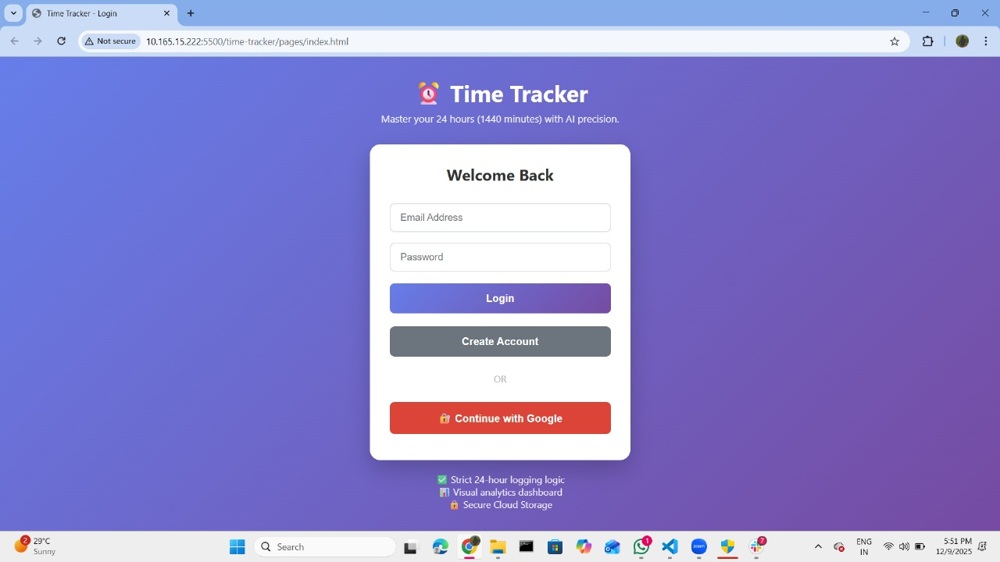
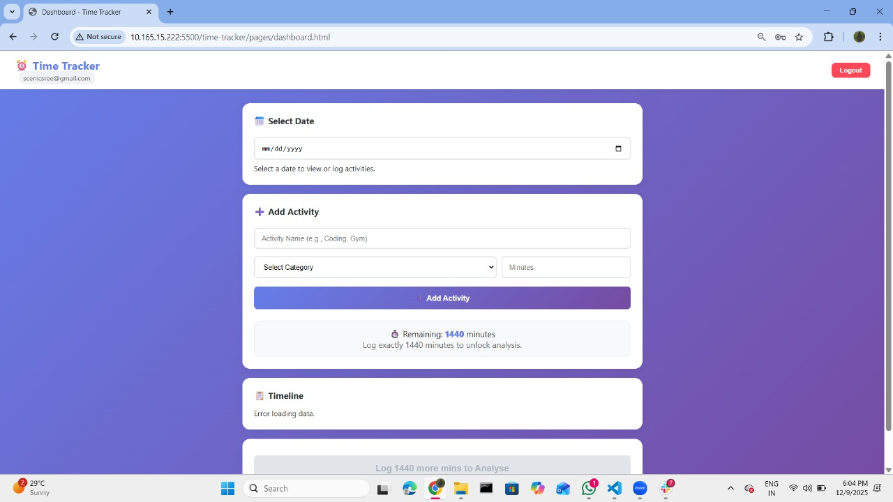
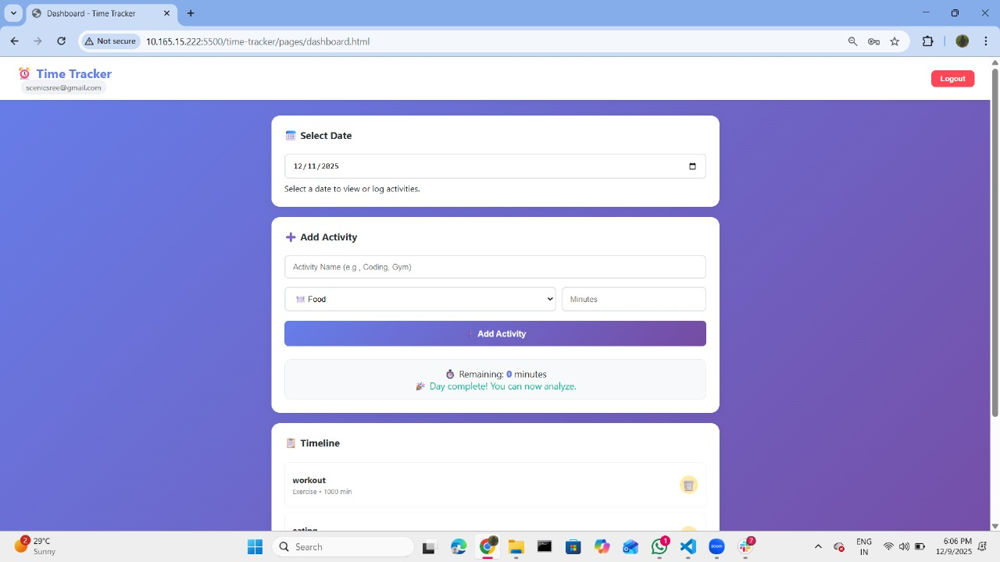
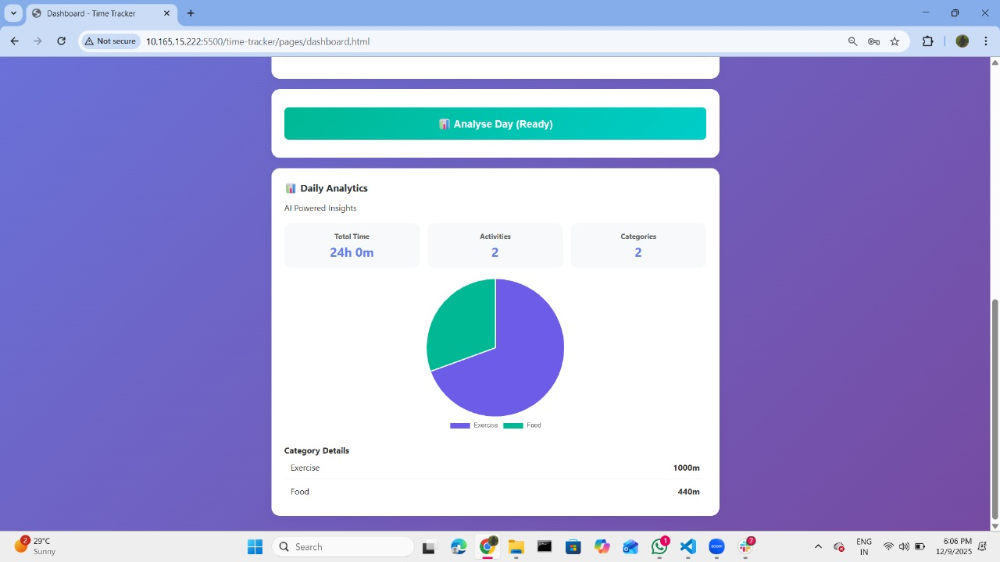

⏰ AI-Powered Daily Time Tracking & Analytics Dashboard

📖 Project Overview

This is a smart Time Tracking Web Application designed to help users log their daily activities with precision. The core philosophy is "The 1440 Rule"—every day has exactly 1440 minutes. This app ensures users account for every single minute before unlocking detailed AI-powered analytics.

Unlike standard to-do lists, this app enforces a strict 24-hour limit, preventing users from logging more time than exists in a day, and provides a visual breakdown of life balance (Work, Sleep, Study, etc.).

🔗 Links

📂 GitHub Repository: [https://github.com/SreelakshmiMithra/time-tracker]

🚀 Live Demo: [INSERT YOUR DEPLOYED LINK HERE]

📹 Video Walkthrough  
[Click here to watch the video](assets/video/video.mp4)

Video Highlights:

0:00 – Landing Page & Login
Logged in from the landing page. New users can create an account.

0:30 – Adding Activities
Entered the date, activity, category, and duration.

1:00 – Completing 1440 Minutes
After reaching 1440 total minutes, the Analyze button becomes active.

1:30 – Viewing Analytics
Clicked Analyze to see the pie chart of the day’s activities.

2:00 – Reset & Logout
Deleted all activities and logged out from the tracker.

🛠️ Tech Stack

Frontend: HTML5, CSS3 (Custom Responsive Design), Vanilla JavaScript (ES6 Modules)

Backend: Firebase (Authentication & Firestore Database)

Analytics: Chart.js (Interactive Data Visualization)

Deployment: GitHub Pages

AI Tools Used: ChatGPT/Gemini (For logic generation, CSS styling assistance, and debugging complex validation rules).

✨ Key Features

1. 🔐 Secure Authentication

User Registration & Login via Firebase Auth.

Google Sign-In integration for one-click access.

Guest/Anonymous login support (optional/if implemented).

2. 📝 Smart Activity Logging

Strict Validation: Users cannot log more than 1440 minutes per day.

Real-time Counter: Displays remaining minutes instantly as you type.

Category Management: Categorize tasks into Work, Study, Sleep, Entertainment, etc.

3. 📊 Interactive Dashboard

Date-Based Navigation: Jump to any specific date to view past logs.

"No Data" Empty States: Beautifully designed placeholders when no logs exist.

Edit/Delete: Full CRUD functionality to correct mistakes.

4. 🧠 Analytics & Insights (The "Analyse" Feature)

Locked by Default: The "Analyse Day" button is disabled until the user logs exactly 1440 minutes.

Visual Breakdown:

Pie Chart: Visualizes time distribution.

Stats Cards: Shows total activities and category diversity.

List View: Detailed percentage breakdown of the day.

5. 📱 Fully Responsive

Optimized for Mobile, Tablet, and Desktop.

Smooth animations and transitions using CSS keyframes.

🤖 AI Usage in Development

This project leveraged AI tools to enhance development speed and code quality:

Logic Generation: Used AI to generate the updateProgress() logic ensuring the math for 1440 minutes was strictly enforced.

UI/UX Design: AI suggested the color palette (gradients) and the card layout structure for a modern feel.

Debugging: Used AI to troubleshoot Firebase permission errors and Chart.js canvas rendering issues (specifically the "canvas is already in use" bug).

💻 How to Run Locally

Follow these steps to set up the project on your machine:

Clone the Repository

git clone [INSERT YOUR REPO LINK HERE]
cd [YOUR REPO NAME]

Setup Firebase Configuration

Create a file named scripts/config.js (if ignored by git) or use the existing one.

Ensure your Firebase API keys are correctly pasted in config.js.

Run the Application

Since this project uses Vanilla JS modules, you cannot simply open index.html file directly. You must use a local server.

Option 1: Using VS Code Live Server (Recommended)

Install the "Live Server" extension in VS Code.

Right-click index.html and select "Open with Live Server".

Option 2: Using Node.js (http-server)

If you have Node.js installed, you can run the app directly using npx:

npx http-server .

Access the App

Open the URL provided in the terminal (usually http://127.0.0.1:8080) in your browser.

📸 Screenshots

1. Landing Page

2. Dashboard (Data Entry)

3. Analytics View

🚀 Future Improvements

[ ] Weekly/Monthly Reports: Aggregate data to show long-term trends.

[ ] Gamification: Badges for consistent tracking (e.g., "7 Day Streak").

[ ] Export Data: Allow users to download their logs as CSV/PDF.

[ ] Dark Mode: Toggle between light and dark themes.

Made with ❤️ and AI